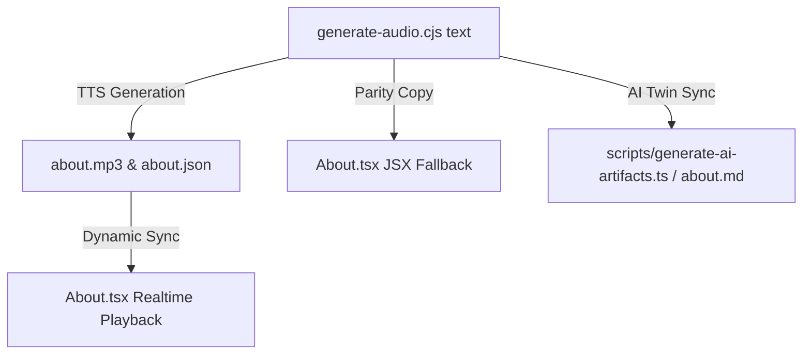

# 🎙️ Audio Narrative Engine (Interactive Spoken Voice Pipeline)

## 1. Architectural Overview & Value
The **Audio Narrative Engine** powers the interactive voice experience in the personal portfolio (currently active in the `About` section). Rather than presenting a static wall of text or cold metric cards, the narrative is spoken aloud with synchronized word-by-word visual illumination.

This architecture creates an intimate, authentic connection with visitors, allowing them to either read passively or listen to Idan David Aviv's story with real-time kinetic text tracking.

---

## 2. Technical Stack & Voice Configuration
The engine uses Microsoft's Edge Neural TTS infrastructure via the `node-edge-tts` npm library:

| Parameter | Value | Rationale |
|---|---|---|
| **Engine** | `node-edge-tts` | Zero API key required, runs locally via Node.js in seconds. |
| **Voice** | `en-US-SteffanNeural` | Articulate, warm, intellectual, and natural pacing. |
| **Pacing / Rate** | `+30%` | Energetic, modern conversational speed (eliminates robotic dragging). |
| **Audio Format** | `audio-24khz-96kbitrate-mono-mp3` | Optimized for fast web delivery and low bandwidth. |
| **Subtitles** | `saveSubtitles: true` | Generates word-level timestamps (`start`, `end`, `part`) automatically. |

---

## 3. Output Asset Standards & Paths
The generator produces two tightly coupled artifacts in `public/assets/audio/`:

1. **Audio File:** `public/assets/audio/about.mp3`
2. **Timestamp JSON:** `public/assets/audio/about.json`

### Data Schema of `about.json`:
```typescript
type WordTimestamp = {
  part: string;  // The word string (including trailing space or punctuation)
  start: number; // Start timestamp in milliseconds
  end: number;   // End timestamp in milliseconds
};
```

---

## 4. Critical Invariants & Rules for AI Agents

### Invariant 1: The Paragraph Delimiter Protocol (`\n\n`)
`node-edge-tts` preserves double newlines (`\n\n`) in the `part` property of the last word in a paragraph (e.g., `part: "experiences.\n\n"`).
The React frontend ([`src/components/sections/About.tsx`](file:///c:/Users/Idan4/Desktop/idan-david-aviv-personal-site/src/components/sections/About.tsx)) relies explicitly on this behavior to chunk words into paragraphs:
```typescript
audioData.forEach(word => {
  if (word.part.endsWith('\n\n')) {
    currentPara.push({ ...word, part: word.part.trim() });
    paras.push(currentPara);
    currentPara = [];
  } else {
    currentPara.push(word);
  }
});
```
> [!CAUTION]
> **PARAGRAPH FORMATTING RULE:**
> In the generator script, paragraphs MUST always be separated by exactly two newlines (`\n\n`). If omitted, the entire narrative will collapse into a single visual block in the UI.

### Invariant 2: The Synchronized Triangle of Truth (Zero Drift)
Whenever the narrative text is updated or refined, an agent MUST update three synchronized surfaces in the exact same phase:



1. **Generator Text:** The `text` constant in `.agent/skills/audio_narrative_engine/scripts/generate-audio.cjs`.
2. **JSX Fallback:** The fallback `<p>` tags in `About.tsx` (rendered if the user has disabled JS or while JSON is loading).
3. **AI Search Twins:** The `about.md` and `llms-full.txt` content in `scripts/generate-ai-artifacts.ts` so AI search engines (Perplexity, SearchGPT, Claude) read the exact same authentic story.

---

## 5. Execution & CLI Commands
The authoritative generation script is located directly within this skill directory:

```powershell
# Via npm script:
npm run audio:generate

# Or directly via Node:
node .agent/skills/audio_narrative_engine/scripts/generate-audio.cjs
```

The script runs synchronously in under 5–10 seconds and logs:
```text
Generating audio and extracting word-level timestamps via EdgeTTS...
Voice: en-US-SteffanNeural | Rate: +30% | Output: .../public/assets/audio/about.mp3
Generation complete!
Saved audio: .../public/assets/audio/about.mp3
Saved timestamps: .../public/assets/audio/about.json
```

---

## 6. React Audio Player Architecture (`About.tsx`)
The frontend integration consists of:
* `<audio ref={audioRef} src="/assets/audio/about.mp3" onTimeUpdate={handleTimeUpdate} />`
* `currentTime` tracking in milliseconds (`audioRef.current.currentTime * 1000`).
* **Word State Resolution:**
  - `status === 'active'` (`start <= time <= end`): `text-white drop-shadow-[0_0_8px_rgba(255,255,255,0.8)]` (kinetic glowing highlight).
  - `status === 'past'` (`time > end`): `text-white/90` (read and completed).
  - `status === 'future'` (`time < start`): `text-white/30` (dimmed awaiting voice).
* Restart capability via `RotateCcw` button which resets playback to 0ms.

---

## 7. Operational Step-by-Step Checklist for New Voice Deployments
When tasked with updating the narrative or adding a new audio section:

- [ ] **Step 1:** Draft and review the narrative text (respecting the 3-act story arc: Academic thesis storytelling, 5–7 years bridging theory to production code, and the North-Star AI methodology).
- [ ] **Step 2:** Paste the new text into `.agent/skills/audio_narrative_engine/scripts/generate-audio.cjs`, verifying `\n\n` separators between paragraphs.
- [ ] **Step 3:** Run `npm run audio:generate` to regenerate `about.mp3` and `about.json`.
- [ ] **Step 4:** Update the JSX fallback text in `src/components/sections/About.tsx`.
- [ ] **Step 5:** Update the AI twin biography in `scripts/generate-ai-artifacts.ts` and run `npm run ai:generate`.
- [ ] **Step 6:** Validate on dev server (`http://localhost:5173/#about`):
  - Audio plays clearly at +30% speed without clipping.
  - Kinetic glowing highlight matches the exact word spoken.
  - Paragraph line breaks render properly.
- [ ] **Step 7:** Run `npm run prepush` to ensure all quality gates pass before commit and deployment.
