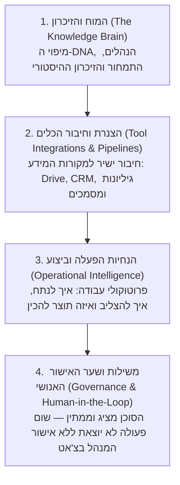

# מניפסט המוצר וההצעה העסקית: בניית מוח העסק ל-AI (Business AI Brain)

## 1. חזון והצעת ערך מרכזית לבעל העסק 🎯

> ### **לבנות לעסק מוח AI אמין שמכיר אותו מבפנים ופועל על 100% נתוני אמת.**
>
> *"לקחת את כל הידע, הנהלים ומקורות המידע של העסק, ולחבר אותם למערכת מסונכרנת אחת — שמאפשרת לכם ולצוות לדבר עם סוכן AI לבחירתכם, חוסכת שעות של עבודה ידנית, ומעניקה שליטה תפעולית מלאה מתוך הצ'אט."*

---

## 2. שלוש בעיות השורש של עסקים מול AI ⚠️

1. **הזיות וחוסר ודאות (The Hallucination Trap)**:  
   מודלים כלליים וציבוריים מנחשים תשובות וממציאים עובדות כי הם מנותקים מהמציאות, מהמחירונים ומהנהלים של העסק. קשה לסמוך עליהם בקבלת החלטות או מול לקוחות.  
   * **הפתרון**: אפיון מעמיק של ה-DNA העסקי ועיגון ישיר במערכות נתוני האמת ונהלי העבודה המאושרים. הסוכן נשען אך ורק על המידע האמיתי — אפס ניחושים.

2. **זמן שנשרף על פעולות ידניות וחיפוש קבצים (Manual Friction)**:  
   שעות יקרות שנשרפות בכל שבוע על חיפוש מסמכים ב-Drive, קובצי אקסל מרובים, העתקה ידנית של נתונים בין מערכות והסברים שחוזרים על עצמם שוב ושוב.  
   * **הפתרון**: שליפה מיידית של מידע רלוונטי בשפה טבעית מתוך כל מקורות המידע, יחד עם הצעות המשך לפעולה שהסוכן מכין מראש עבור המנהל.

3. **דאטה מפוזר בהמון מערכות ומאמץ יקר כדי להחזיק שליטה (Fragmented Reality)**:  
   המידע מבוזר בין Drive, WhatsApp, CRM, יומנים ומיילים. כדי להבין מה קורה בעסק נדרש מאמץ אנושי מתמשך של בדיקות מול עובדים והצלבת נתונים.  
   * **הפתרון**: תשתית שמחברת את המערכות ומאפשרת לקבל דופק עסקי חי ותמונת מצב תפעולית מדויקת ב-3 שניות מתוך חלון הצ'אט.

---

## 3. ארבעת הרבדים של בניית מוח העסק (The 4 Architectural Layers) 🏛️

### 🧠 רובד 1: המוח והזיכרון (The Knowledge Brain)
* **מה בונים**: מארגנים את כל המידע והידע הסמוי של העסק — תחומי פעילות, שירותים, מחירונים, תסריטי שירות, שאלות נפוצות, נהלים פנימיים וטון דיבור — לתוך מערכת זיכרון מובנית (Business DNA).
* **הערך לעסק**: 
  * סוף לקליטת עובד מחדש בכל בוקר — הסוכן מכיר את העסק ולא מתחיל מאפס.
  * מקור אמת יחיד (Single Source of Truth) — עדכון של נוהל או מחיר מתבצע פעם אחת ומסונכרן לכל הרוחב.
  * זיכרון מתועד של כל שלב בדרך שמאפשר לפעול בביטחון ולעדכן את המערכת כשהעסק צומח.

### 🔌 רובד 2: הצנרת וחיבור הכלים (Tool Integrations & Data Pipelines)
* **מה בונים**: תשתית שמחברת את מוח ה-AI ישירות למקורות שבהם המידע חי כיום: Google Drive, גיליונות Excel / Google Sheets, מערכות CRM (Monday, HubSpot, Notion), יומנים ומסמכים מקומיים.
* **הערך לעסק**: 
  * נגישות מיידית לנתוני אמת בזמן אמת בלי להוריד, להעתיק או להדביק קבצים ידנית.
  * אפס שינוי הרגלים — ממשיכים לעבוד בכלים הקיימים.

### 🎯 רובד 3: הנחיות עבודה ופרוטוקולים (Operational Intelligence)
* **מה בונים**: פרוטוקולי פעולה מוגדרים המנחים את הסוכן איך לחשוב צעד אחד קדימה:
  * איך להצליב נתוני אמת מול נהלי העבודה כדי להבין את התמונה המלאה.
  * איך לסכם מצב ולהציע כיוון פעולה מומלץ להמשך.
  * הכנת תוצרים מוכנים לשימוש (Ready-to-Use) — טיוטות מענה, עדכוני שדות או משימות ליומן.
* **הערך לעסק**: במקום שהמנהל יחשוב מה הצעד הבא — הסוכן מכין את הקרקע ומציג פתרון סגור.

### 🛡️ רובד 4: משילות ושער האישור האנושי (Governance & Human-in-the-Loop)
* **מה בונים**: מנגנון נעילה קשיח שבו הסוכן הוא עוזר ומכין, אך לעולם אינו מחליף את שיקול הדעת של המנהל:
  * שום פנייה החוצה ללקוח ושום שינוי נתונים במערכת לא מתבצעים אוטונומית.
  * שקיפות מקורות מלאה — הסוכן מציג מאיזה מסמך או שדה נשלף המידע.
  * אישור במילה אחת בצ'אט — המנהל כותב "מאושר" בשיחה, והפעולה מתבצעת מיד.
* **הערך לעסק**: שליטה מלאה ושקט נפשי — אפס פחד מקופסה שחורה או מטעויות של סוכן עצמאי.

---

## 4. תהליך העבודה מול הלקוח (The 1-2-3 Client Process) 🚀

שלושה שלבים פשוטים וממוקדים, נטולי חיכוך והתעסקות טכנית מצידו של בעל העסק:

1. **01. מיפוי ראשוני ובדיקת היתכנות (30–60 דק')**:  
   בשיחה ממוקדת בגובה העיניים בודקים יחד את תהליכי העבודה, המערכות וסוג המידע הקיים בעסק, ומוודאים שיש כאן היתכנות לאימפקט עסקי ותפעולי אמיתי.
2. **02. התאמה ובנייה מאחורי הקלעים (אפס התעסקות טכנית מהצד שלכם)**:  
   בזמן שבעל העסק ממשיך לנהל את העסק כרגיל, אנחנו מקימים את תשתית הזיכרון המרכזית, מחברים את הצנרת למקורות המידע ומגדירים את הנחיות הפעולה. הלקוח לא נוגע בקוד ולא מסתבך בהגדרות טכניות.
3. **03. הטמעה במערכת ועלייה לאוויר (חיבור ישיר לצ'אט שלכם)**:  
   מחברים את מוח ה-AI ישירות לסביבת הצ'אט שבעל העסק והצוות כבר רגילים לעבוד איתה (ChatGPT, Claude, Gemini או כל כלי אחר), מוודאים שהוא פועל ב-100% לפי הסטנדרט, ויוצאים לדרך.

---

## 5. תיאום ציפיות אמיתי והסרת חסמים (The Reality Check) 🤝

ללא משחקי מכירה, ללא מבחני התאמה מלאכותיים וללא הבטחות שווא:

* **עובדים עם המידע שכבר קיים בעסק**: לא צריך "מבצע סדר" ולא צריך להכין קבצים מיוחדים מראש. מתחילים מהמסמכים, הנהלים והטבלאות שקיימים אצלכם כיום (בדרייב, באקסל, ב-CRM או במיילים).
* **אתם מציגים את הצרכים — אנחנו פותרים את החלק הטכני**: במקום להסתבך עם הגדרות ופרומפטים, אתם רק מסבירים איך העסק עובד בשיחה פתוחה.
* **בלי להחליף מערכות ובלי לשנות הרגלים**: המוח מתלבש על הכלים הקיימים. הצוות לא צריך ללמוד תוכנה חדשה.
* **ליווי מקצועי צמוד בלי להחזיק מתכנת**: כתובת מקצועית שמחזיקה את המערכת, מוודאת יציבות, ומעדכנת אותה כשהעסק צומח.

---

## 6. מדיניות שקיפות ופרטיות מידע (Privacy & Data Governance) 🔒

* **התאמה פרטנית לפי סוג המנוי**: נושא אימון המודלים (Zero Data Training) והפרדת הסביבות תלוי ישירות בסוג המנוי והתשתית שבה העסק בוחר לעבוד.
* **הנחיית משילות**: נושא זה אינו מועמס בהבטחות גורפות בדף הנחיתה הראשי, אלא נידון בשקיפות מלאה ומותאם אישית בשיחת האפיון הראשונה, בהתאם לסטנדרט האבטחה הנדרש של העסק.

