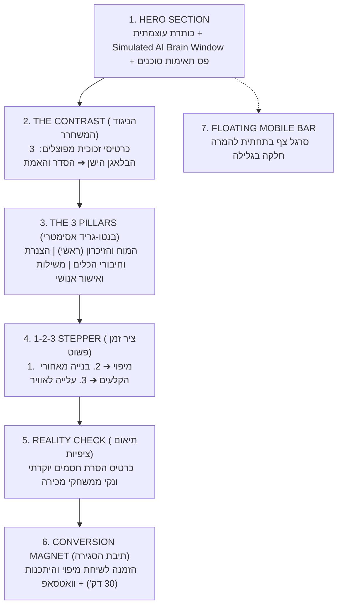

# מניפסט חזון ה-UX ופילוסופיית ההמרה: דף שירותים "מוח AI לעסק" (`/services`)

## 1. הבעיה הויזואלית המרכזית: "להמחיש את הבלתי-נראה" (Visualizing the Invisible) 👁️

מוצר כמו **"מוח AI לעסק"** אינו מוצר פיזי ואפילו לא אפליקציית SaaS עם עשרות מסכים נפרדים.  
מדובר ב**ארכיטקטורה של ידע, חיבורים למערכות והנחיות פעולה לסוכן**.

> [!WARNING] המלכודת הנפוצה של 90% מדפי ה-AI כיום:
> דפי נחיתה רבים נראים כמו "קיר טקסט עם כרטיסים שחורים" או שימוש באיורי AI גנריים (רובוטים, כדורי ניאון זוהרים, גרפיקות חלל מצועצעות).  
> **התוצאה:** בעל העסק לא מבין מה הוא באמת מקבל, חושב שמדובר ב"ייעוץ באוויר", ומאבד עניין תוך שניות בודדות.

---

## 2. עקרון היסוד שלנו: המוצר הוא לא תוכנה חדשה — הוא מוח שמתלבש על הצ'אט שאתם כבר מכירים 💬

באתרים של חברות SaaS מסורתיות, החברות מציגות דשבורד מורכב ותוכנה ייעודית שפיתחו.  
**אצלנו המציאות שונה לגמרי — וזה היתרון הכי גדול שלנו מול בעל העסק:**
* בעל העסק והצוות שלו **לא צריכים ללמוד שום תוכנה חדשה**.
* האינטראקציה מתבצעת ישירות בתוך **חלון צ'אט שהם כבר מכירים ומשתמשים בו** (ChatGPT, Claude, Google Gemini, או סביבת צ'אט קיימת).

### 💡 איך עובדה זו מעצבת את הבחירות הויזואליות בדף?
1. **האלמנט הויזואלי המרכזי (Visual Anchor) חייב להיות חלון שיחה מוכר עם "כוחות-על"**:
   * לא מראים דשבורד מורכב עם 50 גרפים שמלחיץ את בעל העסק.
   * מראים **חלון צ'אט נקי, מוכר ומרגיע**, אבל כזה שמוצגות בו תשובות שמבוססות על נתוני האמת של העסק, לצד תגיות אמינות חיות (`[✓ מקור: נוהל תמחור פנימי]`, `[✓ מסונכרן ל-CRM]`).
2. **המחשה ויזואלית של "המנוע שמאחורי הצ'אט" (The Engine Behind the Chat)**:
   * אם כל אחד יכול לפתוח ChatGPT בחינם, למה לפנות לעידן?
   * התשובה הויזואלית: מראים איך מתחת לחלון הצ'אט מחובר המוח המובנה (ה-DNA, הנהלים והחיבור למערכות נתוני האמת) — שזה המנוע האמיתי שהופך סתם צ'אטבוט לסוכן שמכיר את העסק מקצה לקצה.
3. **מסר ויזואלי של "אפס חיכוך ואפס עקומת למידה" (Zero Learning Curve)**:
   * הדגשה ויזואלית בולטת: *עובד בצורה חלקה עם סוכן ה-AI המועדף עליכם — אין שום מערכת מסובכת להטמיע בעסק.*

---

## 3. ממצאי מחקרי ההמרה והסטנדרט העולמי (2026 Benchmark) 📊

מניתוח דפי הנחיתה בעלי יחס ההמרה הגבוה ביותר בתחום ה-B2B AI (חברות כמו Dust, Linear, Harvey וסוכנויות בוטיק של Fractional AI):

### א. עקרון ה-"Show, Don't Tell" (הדמיה קונקרטית מול העיניים)
* לקוחות קונים מה שהם יכולים **לראות ולדמיין בשימוש היומיומי שלהם**.
* האלמנט הממיר ביותר בדף AI הוא **Simulated UI / Interactive Mockup**: חלון נקי ומעוצב שמדגים בזמן אמת שאילתה של בעל עסק ותשובה מבוססת עובדות של הסוכן.
* **תגיות אמינות (Trust Badges):** שילוב תגיות מקור ואימות בתוך התשובה (`[✓ נוהל שירות 2026]`, `[✓ סנכרון CRM]`) מסיר ברגע את החשש מהזיות.

### ב. חוויית מגע חיה (Tactile Feedback & Human-in-the-Loop)
* כשההדמיה היא אינטראקטיבית, היא עוברת מ"הבטחה שיווקית" ל"מערכת עובדת קיימת".
* מתג תרחישים חי מאפשר לראות שני שימושים עסקיים שונים.
* כפתור אישור אנושי שמגיב בלחיצה ומשתנה לחיווי ירוק של אישור פעולה (`[ ✓ הפעולה אושרה והמערכות עודכנו ]`) ממחיש פיזית שהשליטה תמיד נשארת אצל המנהל.

### ג. בנטו-גריד אסימטרי (Asymmetric Bento Grid)
* שבירת השעמום של גריד סימטרי לטובת היררכיה חדה:
  * **כרטיס ראשי ענק (Hero Card)**: מייצג את המוח והזיכרון.
  * **כרטיס צדדי מקושר**: מייצג את הצנרת וחיבורי הכלים.
  * **כרטיס תחתון רחב**: מייצג את הנחיות העבודה, המשילות ושער האישור האנושי.

### ד. חוק ה-5 שניות לקצב סריקה (Visual Rhythm & F-Pattern)
הובלת עין מתוזמנת מלמעלה למטה ב-6 מקטעים ברורים:
1. **Hero**: הבטחה גדולה + הדמיית צ'אט אינטראקטיבית + פס תאימות סוכנים.
2. **The Contrast (הניגוד)**: 3 כרטיסי כאב ופתרון מפוצלים (לפני ➔ אחרי).
3. **The System (המערכת)**: בנטו-גריד 3 עמודי התווך.
4. **The Path (הדרך)**: סרגל תהליך 3 שלבים (1-2-3 Stepper).
5. **The Reality Check (תיאום ציפיות)**: כרטיס הסרת חסמים מבודד.
6. **The Close (הסגירה)**: תיבת המרה מגנטית לשיחה של 30 דקות + וואטסאפ.

### ה. סרגל צף תחתון במובייל (Floating Mobile Sticky CTA)
* מעל 60% מהתנועה מגיעה מסמארטפונים.
* סרגל צף דק ואלגנטי מופיע בגלילה מעבר ל-Hero ומאפשר תיאום שיחה או פנייה בוואטסאפ במרחק לחיצת אגודל מיידית מכל נקודה בדף.

---

## 4. מפת הזרימה הארכיטקטונית של הדף (`/services`) 📐

---

## 5. שפה ויזואלית וסטנדרטים עיצוביים (Visual DNA) 🎨

* **Dark Core & Glassmorphism**: רקע כהה עמוק (`#050510`), כרטיסי זכוכית שקופים-למחצה (`bg-white/[0.03]` עד `bg-white/[0.06]`), ומסגרות דקיקות (`border-white/10`).
* **Ambient Glow Lighting**: הילות עדינות מבוססות פלטת המותג (`idan-david-aviv-blue`, `idan-david-aviv-cyan`, `idan-david-aviv-gold`).
* **Zero Robots**: איסור מוחלט על גרפיקות רובוטים ילדותיות או אלמנטים מצועצעים. הויז'ואל כולו טכנולוגי, בוגר, מבוסס מסמכים ונתונים.
* **תאימות RTL מוחלטת (`rtl_guardian`)**: שימוש בלעדי במאפיינים לוגיים ב-Tailwind (`ms-`, `me-`, `ps-`, `pe-`, `text-start`) למניעת שבירת ממשק.

